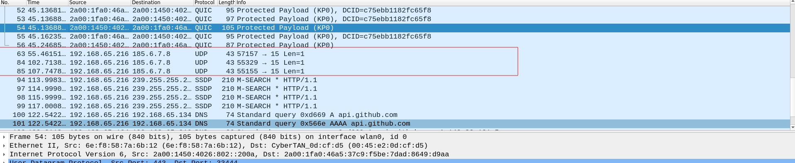

# Table of Contents
* [About](#about)
* [Build](#build)
* [Usage](#usage)
* [Documentation](#document)

## About 
This program can be used as client to connect using UDP sockets or as server
to listen on a chosen port.

## Build 
Builded and tested in 5.18.5-arch1-1 version of arch linux.

~~~
git clone https://github.com/krisszzzz/UDP-client-server
cd UDP-client-server
make
~~~

## Usage 
This program is using UDP sockets to connect to network with passed ip address and port or
you can use this program as server to listen on a passed port.  
~~~
Usage: ./udp [options] <optional_arguments>  
Options:  
--help               Display this information.   
--server <port>      Start listen on a chosen port. If no port was provided the default port (80) will be used  
--client <ip> <port> Connect using UDP with selected ip address and port. 
                     You can leave out the port as an argument, in which case port 80 will be used by default. 
                     You can also leave out the ip address along with it, in which case it will be set 
                     to 127.0.0.1 (localhost). But passing a port without passing an ip address will result 
                     in an error: an ip address is always expected as the first argument.  
~~~

I checked the client side of program with [Wireshark](https://ru.wikipedia.org/wiki/Wireshark). I chose 185.6.7.8 ip address and 15 port. You can see the result here.

## Documentation 
I created [pdf documentation](https://github.com/krisszzzz/UDP-client-server/blob/master/doc.pdf) with using [Doxygen](https://doxygen.nl).
